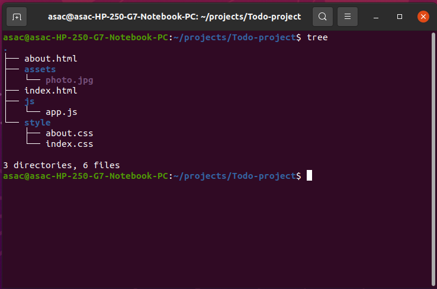

# Task 06:

## Overview:
Today will be the beginning of a multi-Task project, where you will build a ToDo List website called **ToDo**.

## Problem Domain:
You are building a ToDo List Website, where the users can display their tasks and check the status of each one.

## Requirements:

1. **Set up your Github Repository:**
   - Create a new repository called `todo-project`
   - Add a **README.md** file.
   - Clone this repo to your local machine.
   - Check out a new branch called `todo-html` for today's task.
   - Open it in VS code.
  
2. **You will create two pages, `index.html` and `about.html`**:
   1. Home Page (index.html):
      - In `Header`, add navigating to any other pages. It should also contain the name of the website along with the logo.
      - In `Main`, render a **table** with two columns, one for the tasks and the second for the status. You should add at least 3 tasks.
      - In `Footer`, you should have copyright and anything you feel fits on your website.

   2. About Page:
      - In `Header`, add navigating to any other pages. It should also contain the name of the website along with the logo.
      - In `Main`, you should contain two sections:
          - Section for your information such as(photo, name, description, etc…)
          - Section for static **form** where the user has to provide his contact information (name, email, message) and submit button.
      - In `Footer`, you should have copyright and anything you feel fits on your website.

3. **Style your app:**
    - Now, it is your job to style the website to be attractive as much as you can.
  

### The tree of the project should be like this:

## Submission Instructions:
- When your work is complete and ready for submission, push to the `todo-html` branch.
- Create a pull request
- Deploy to the Github pages.
- Submit the pull request and deployed version (Live URL) links.
- Merge `todo-html` with the main branch
- What observations or questions do you have about what you’ve learned so far?
- How long did it take you to complete this assignment? And, before you started, how long did you think it would take you to complete this assignment?