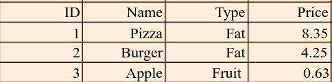

# Restaurant Project

## Task 11

### **Overview**

Today will be the beginning of a multi-lab project, where you will build a restaurant project with pairing partners.

## **Requirements**

### **Set up your Github Repository***

- Create a new repository called `Restaurant`
- Add a **README** file to add your changes for each day.
- Clone this repo to your local machine.
- Check out a new branch called `events` for today's lab.
- Open it in VS code.

You will create only one page for this lab `index.html`.
### **Home page**
1. `Header` for navigating to any other pages.

2. You will add a `form` with the following fields:
    - Food Name.
    - Types of the food `<select>` with the following options:
        - Fruit and vegetables.
        - Starchy food.
        - Dairy.
        - Protein.
        - Fat.
    - Price.
    - Submit button.

3. `Footer` will have some social media links with copyright.

### **Javascript**

1. You will create a `constructor` to generate a food object which will be rendered in the main section of your app.js file.
    - Food ID.
    - Food Name.
    - Type.
    - Price.

You will create an instance each time you submit the `form`, and fill the object from the `form` inputs.
2. Create a method to generate a unique four digits for the food id number.
3. You will add an event listener to get the data from the `form` instead of having hard-coded data.
4. You will create a `render prototype` method to render each food name with their information from the `form` on the home page as a table view as below.

`Note`: You will render the data in the table whenever you submit the `form` (you will use event listener for the `form`).

### **Style**

1. Add some style for the header and the footer
2. Add backgrounds, font colors, google fonts, and any additional style.
3. Use a suitable color palette for your website. You can use [ColorHunt](https://colorhunt.co) .

**Note:**
Be creative and make your page professional.

## Submission Instructions:
- When your work is complete and ready for submission, push to the `events` branch.
- Create a pull request.
- Deploy to the Github pages.
- Submit the pull request and deployed version (Live URL) links.
- Merge `events` with the main branch.
- Answer these two questions in the submission comments: 

    - What observations or questions do you have about what you’ve learned so far?
    - How long did it take you to complete this assignment? And, before you started, how long did you think it would take you to complete this assignment?